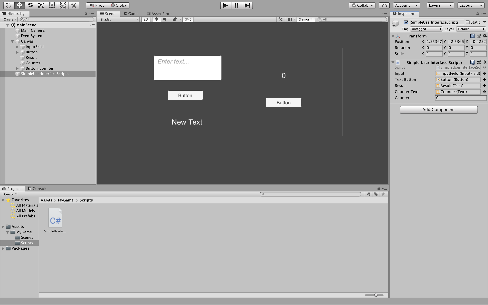

# inclass-SimpleUserInterface-cs-millig

### Project description: 
+ create a GUI in Unity
+ write a script for buttons

### Development platform: 
+ macOS Mojave
+ Unity 2019.1.14f1
+ Visual Studio Code 1.41.1

### Target platform: 
WebGL (refRes: 1920x780)

### Visuals: 

##Necessary setup/execution steps:
none

### Third party material: 
Template: https://github.com/3ahmnm-htlsbg/Unity2019114f1-2D-Template 

### Project state: 
TODO

### Limitations: 
none 

### Lessons Learned: 
+ revision of writing a script 

Copyright by millig